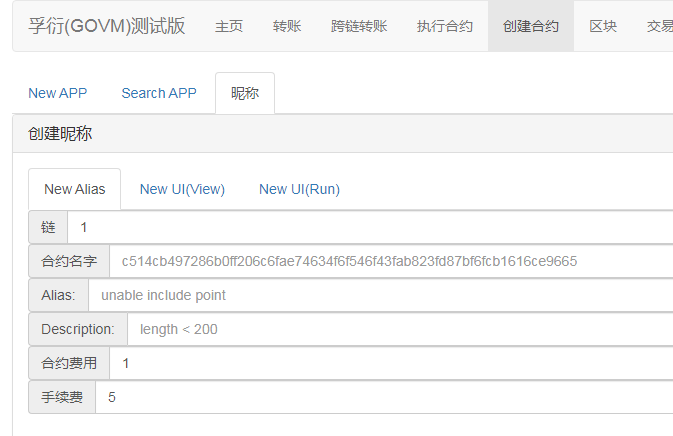
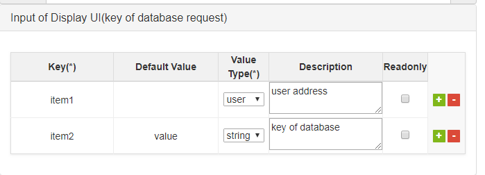

# 昵称

因为合约的名字是一个很长的哈希值，不容易辨认和记忆。  
平台提供了昵称功能，可以为合约注册昵称。且可以注册查询页面和操作页面，更加方便用户执行合约。昵称功能是由合约c514cb497286b0ff206c6fae74634f6f546f43fab823fd87bf6fcb1616ce9665提供。  
注册完昵称后，可以注册查询页面和操作页面  
查询页面：用于查询已经存在数据库中的数据，并将其显示在页面上。  
操作页面：用于方便用户输入参数，执行合约。  

## 昵称注册

昵称不能带有点号”.”，昵称谁先注册就属于谁的，有限期2年，可以续期。  
可以为同一个合约注册多个昵称。  
手续费的多少根昵称长度、描述长度相关。  
任何人都可以为任何合约注册昵称（需要费用）。  

## 查询页面的注册

查询页面查询的是直接查询数据库中的数据，不会进行其他操作，所以查询页面对用户来说是免费的（注册需要费用）。  
页面注册都只能是昵称的拥有者才能注册。  

* Alias：昵称
* Index：页面的序号，从0开始，如果对应序号的页面已经存在，则老的会被新的覆盖掉。不能跳过。
* Title：页面的标题，将在页面列表中显示。
* Struct Name：数据库中的数据类型，默认都是DB Data，如果是日志类型，则选择Log Data
* Value Type：数据库中数据的格式，默认为json格式
* 手续费：注册的手续费由页面的信息量决定，信息越多，费用越高。

每个数据都有Key和Value。Key可能是由多个部分组成，如用户名、序号等等  
所以查询页面需要设置key的组成部分，他们将按照顺序，拼接成一个key，用它查询数据库  
**参数输入部分**：  

* Key：用于页面显示的标签名
* Default Value：默认值，如果没有，可以为空
* Value Type：值的类型，它将根据类型，对值进行编码，方便拼接
* Description：参数的描述，可以为空
* Readonly：是否只读，如果是只读的，需要填默认值

**内容显示部分**：

* Display Key：页面显示的标签名
* Value Key：显示的值在json格式中的key，如果数据有多级，用点”.”分隔，如果为空，则显示全部
* Value Type：将值格式化后显示，如果不需要格式化，则为default

## 操作页面的注册

* Alias：页面所属的昵称，该昵称一样必须是自己的
* Index：index需要修改（查询页面也算），如果前面已经使用了0,1,2，则当前需要设置为3，否则将覆盖之前的页面
* Title：页面的标题，将在页面列表中显示。
* Prefix parameter：默认为空，这个填写的是hex，执行合约时，该值将作为运行参数的前缀传给合约。
* Value Type：合约参数的类型，默认为json（看合约里如何解析参数的）。
* 手续费：注册的手续费，大部分为数据存储的费用。
* Cost(UI Run)：执行合约时，需要的费用（类似电影票票价），如果合约不收费，则为"0"

* Display Key：显示的标签名
* Name：json参数中的Key
* Default Value：默认值，如果没有，则为空
* Value Type：数据的类型，执行合约时，数据将根据类型进行转换（默认都是字符串）。
