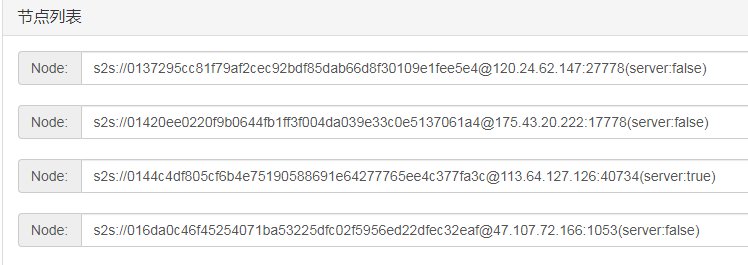

# 孚衍（GOVM）挖矿教程

## 说明

1. GOVM是一个区块链项目，全新的架构，自主创新。没有ICO，没有上交易平台，短期内虚拟货币无法交易
2. 不保证你挖矿会有收益，如果项目失败，虚拟货币最终将一文不值
3. 如果你对技术有任何建议，可以在评论留言或私信给我
4. 新版本和旧版本不兼容，如果已经安装过旧的版本，需要将database和govm删除
   1. 将govm/conf/wallet.key保存到安全位置
   2. 停止govm窗口，执行database文件夹中的uninstall，关闭所有窗口
   3. 删除database和govm文件夹
5. DPOS节点需要部署GOVM节点
6. 想要启动多个挖矿程序的矿工，需要部署GOVM节点（官网节点只支持一个账号一个挖矿程序）

## 硬件要求

1. 64位的windows系统，至少windows7(如果是linux或mac，整体流程类似)  
    查看方式：计算机/我的电脑->右键->属性->系统类型:64位操作系统  
    如果是32位的，不支持。
2. 比较大的磁盘空间  
    区块链需要存储大量的数据，所以需要大量的空间，至少需要50G  
    前期，因为交易比较少，需要的空间比较少，后续1天可能会有1G的新数据  
    如果有固态硬盘，会更好  
3. 联网  
    软件一直需要联网，同时因为需要跟其他节点一直同步数据，所以如果网络太差，将影响挖矿
4. 所有的路径/文件夹名字不能有中文或空格

## 环境搭建

### golang安装

1. 国内下载地址：  
    https://studygolang.com/dl  
    https://golang.google.cn/dl/  
2. 下载“go1.13.1.windows-amd64.msi”
3. 直接安装，都是默认配置，无需修改(若修改，路径/文件夹名字不能有中文或空格)

### git安装

1. 下载地址：  
    官网：https://git-scm.com/downloads  
    国内地址：https://pc.qq.com/detail/13/detail_22693.html  
2. 点击windows，下载  
      
3. 下载完后，直接安装，都是默认配置（不能有中文路径）

### 配置代理

1. 国内需要配置代理，国外的无需配置代理
2. 计算机/我的电脑->右键
3. 高级系统配置->高级
4. 环境变量
5. 系统变量->新建：变量名:GOPROXY，变量值:https://goproxy.io
6. 然后所有都点击确定，退出配置
7. win10和win2012建议重启电脑

## 下载源码

1. 选择一个磁盘(需要有比较多的可用空间)
2. 创建一个文件夹(不用中文，路径别太长)
3. 进入文件夹，空白处点击右键，选择“Git Bash Here"
4. 输入并回车：git clone https://github.com/lengzhao/database.git
5. 输入并回车：git clone https://github.com/govm-net/govm.git
6. 将开始下载代码
7. 成功以后，应该会有2个文件夹，database和govm
8. 代码下载完成后，编译代码
9. 首先编译database(数据库),双击执行upgrade.sh或者按照下面操作，确保文件夹下有生成可执行文件database
10. 编译govm，双击执行govm文件夹下的upgrade.sh，确保文件夹下生产可执行文件govm  

## 防火墙设置

1. 如果没有防火墙，直接跳过
2. **如果有杀毒软件，请将文件夹设置为可信的，否则app会被杀毒软件清理**
3. 设置原因：

   * 智能合约的执行会频繁启动合约程序，容易被当做病毒

4. 这里将介绍360的设置，其他的自己上网查
5. 打开360安全卫士
   
6. 点击木马查杀页面
7. 点击右侧的信任区（见上图）
8. 点击添加目录
    
9. 选择govm文件夹，然后确认

## 使用备份的数据

1. 该操作可以不执行。如果不执行这一步，将从头开始同步数据，耗时比较长，需要几天时间
2. 如果govm已经启动，将其退出(关闭窗口)
3. 如果database已经启动，将其退出(关闭窗口和执行database/uninstall.sh)
4. 如果database文件夹里有db_dir，请将其删除
5. 浏览器登陆 http://govm.net/dl/
6. 下载：database_data_v\*.tar.gz和govm_app_v\*.gz
7. 下载后，将database_data_v\*.tar.gz文件放入database文件夹，并解压到当前文件
8. 解压成功后，会在database文件夹里多一个db_dir文件夹，没有表示异常，请确认操作
9. 将govm_app_v\*.gz放到govm文件夹里，并解压到当前文件夹
10. 解压成功后，会在govm文件夹里多一个app文件夹，没有表示异常，请确认操作
11. 进入文件夹govm->tools->rebuild，双击执行rebuild.sh，将重新编译智能合约

## 启动程序

1. 将数据库注册为系统服务，进入database文件夹，双击install.sh，杀毒软件有可能会有风险提示，需要允许本次操作  
   * 如果显示“Access is denied.”，表示没有权限，直接执行database.exe启动数据库
      
2. 启动govm，点击govm.exe，程序将启动，并打印版本信息（software version）  
      
3. 可以使用浏览器，登陆http://localhost:9090
4. 程序启动后，会自动连接到其他的节点，开始同步数据（同步时间与网络和磁盘有关）
5. 同步完成后，将自动开始挖矿
6. 每分钟一个区块，谁挖到，奖励就是谁的，所以需要竞争，电脑的计算能力越强，越容易挖到

## 保存钱包文件

conf文件夹下的**wallet.key**是钱包文件，请备份保存  
如果丢失，将永久丢失，虚拟货币再也找不回来

## 检查

### 确认是否连接上其他节点

1. 浏览器打开http://localhost:9090
2. 点击右上角的Node
3. 确认Nodes中有多个节点，如下图  
      
4. 如果没有，等待1-2分钟，刷新页面，确认Nodes中已经有节点了，如果还没有其他节点，请重启govm

### 确认开始同步区块

1. 浏览器打开http://localhost:9090
2. 点击区块(Block)
3. 区块的时间有变化，更新完成后，区块的时间将跟北京时间一样，如下图  
    

### 更新软件

#### 更新数据库

1. 更新数据库前，需要先将govm窗口关闭
2. 进入数据库文件夹database
3. 关闭数据库的窗口
4. 执行upgrade，更新数据库
5. 启动数据库：执行install，将数据库注册为服务，
   * 如果异常，直接执行database.exe

#### 更新GOVM

1. 关闭govm窗口
2. 可以直接双击upgrade.sh进行升级
3. 双击govm.exe启动程序
4. 如果出现异常，程序会直接退出，否则会一直在运行

## 重新编译智能合约

1. 进入govm/tools/rebuild/，空白处，右键选择“Git Bash Here"
2. 输入并回车"./rebuild.sh"
3. 将重新编译智能合约
4. 有显示“result,chain: 1 <nil>”就表示成功了

    

## 挖矿

1. 用文本编辑器(记事本)打开conf/conf.json
2. 将配置one_conn_per_miner的true改为false
3. 请参考[挖矿教程](mining.md)
4. 将servers中的地址改为自己节点的地址

## 更多信息

QQ群：1102176079

订阅号  

[discord](https://discord.gg/u3wYFkD)

联系方式：  

