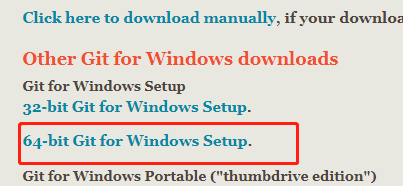

# 孚衍（GOVM）挖矿教程(windows)

## 说明

1. GOVM是一个区块链项目，全新的架构，自主创新。没有ICO，没有上交易平台，短期内虚拟货币无法交易
2. 不保证你挖矿会有收益，如果项目失败，虚拟货币最终将一文不值
3. 如果你对技术有任何建议，可以在评论留言或私信给我

## 硬件要求

1. 64位的windows系统，至少windows7(如果是linux或mac，整体流程类似)  
    查看方式：计算机/我的电脑->右键->属性->系统类型:64位操作系统  
    如果是32位的，不支持。
2. 比较大的磁盘空间  
    区块链需要存储大量的数据，所以需要大量的空间，至少需要50G  
    前期，因为交易比较少，需要的空间比较少，后续1天可能会有1G的新数据  
    如果有固态硬盘，会更好  
3. 联网  
    软件一直需要联网，同时因为需要跟其他节点一直同步数据，所以如果网络太差，将影响挖矿
4. 所有的路径/文件夹名字不能有中文或空格

## 环境搭建

### golang安装

1. 国内下载地址：  
    https://studygolang.com/dl  
    https://golang.google.cn/dl/  
2. 下载“go1.13.1.windows-amd64.msi”
3. 直接安装，都是默认配置，无需修改(若修改，路径/文件夹名字不能有中文或空格)

### git安装

1. 下载地址：  
    官网：https://git-scm.com/downloads  
    国内地址：https://pc.qq.com/detail/13/detail_22693.html  
2. 点击windows，下载  
      
3. 下载完后，直接安装，都是默认配置（不能有中文路径）

### 配置代理

1. 国内需要配置代理，国外的无需配置代理
2. 计算机/我的电脑->右键
3. 高级系统配置->高级
4. 环境变量
5. 系统变量->新建：变量名:GOPROXY，变量值:https://goproxy.io
6. 然后所有都点击确定，退出配置
7. win10和win2012建议重启电脑

## 下载源码

1. 选择一个磁盘(需要有比较多的可用空间)
2. 创建一个文件夹(不用中文，路径别太长)
3. 进入文件夹，空白处点击右键，选择“Git Bash Here"
4. 输入并回车：git clone https://github.com/lengzhao/database.git
5. 输入并回车：git clone https://github.com/lengzhao/govm.git
6. 将开始下载代码
7. 成功以后，应该会有2个文件夹，database和govm
8. 代码下载完成后，编译代码
9. 首先编译database(数据库),执行upgrade.sh或者按照下面操作，确保文件夹下有生成可执行文件database

    ```bash
    cd database/
    go build
    ll database
    cp ./conf/conf.json.bak ./conf/conf.json
    ```

    

10. 编译govm  

    **如果有杀毒软件，请将文件夹设置为可信的，否则app会被杀毒软件清理**  
    直接执行govm文件夹下的upgrade.sh，也可以使用下面的方式

    ```bash
    cd ../govm/
    go build
    ll govm
    ```

11. 结果应该如下，有生成govm(直接查看文件夹下是否有这个可执行文件)

    

## 防火墙设置

1. 如果没有，直接跳过，这里将介绍360的设置，其他的自己上网查
2. 设置原因：

   * 智能合约的执行会频繁启动合约程序，容易被当做病毒
   * 挖矿时，会消耗较多的CPU，容易被当做病毒

3. 打开360安全卫士
   
4. 点击木马查杀页面
5. 点击右侧的信任区（见上图）
6. 点击添加目录
    
7. 选择govm文件夹，然后确认

## 使用备份的数据

1. 该操作可以不执行。如果不执行这一步，将从头开始同步数据，耗时比较长，需要几天时间
2. 浏览器登陆 http://govm.net/dl/
3. 下载：database_data_v\*.tar.gz和govm_app_v\*.gz
4. 下载后，将database_data_v\*.tar.gz文件放入database文件夹，并解压到当前文件
5. 解压成功后，会在database文件夹里多一个db_dir文件夹，没有表示异常，请确认操作
6. 将govm_app_v\*.gz放到govm文件夹里，并解压到当前文件夹
7. 解压成功后，会在govm文件夹里多一个app文件夹，没有表示异常，请确认操作
8. 进入文件夹govm->tools->rebuild，双击执行rebuild.sh，将重新编译智能合约

## 启动程序

1. 将数据库注册为系统服务，进入database文件夹，双击install.sh，杀毒软件有可能会有风险提示，需要允许本次操作  
   * 如果提示“Access is denied.”，表示没有权限，可以直接执行database.exe启动数据库
      
2. 启动govm，点击start.sh，程序将启动，并打印版本信息（software version）  
      
3. 可以使用浏览器，登陆http://localhost:9090
4. 程序启动后，会自动连接到其他的节点，开始同步数据（同步时间与网络和磁盘有关）
5. 同步完成后，将自动开始挖矿
6. 每分钟一个区块，谁挖到，奖励就是谁的，所以需要竞争，电脑的计算能力越强，越容易挖到

## 保存钱包文件

conf文件夹下的**wallet.key**是钱包文件，请备份保存  
如果丢失，将永久丢失，虚拟货币再也找不回来

## 检查

### 确认是否连接上其他节点

1. 浏览器打开http://localhost:9090
2. 点击右上角的Node
3. 确认Nodes中有多个节点，如下图  
      
4. 如果都没有节点，先确认网络是否正常，如果网络正常，直接点击Submit，重新连接
5. 刷新页面，确认Nodes中已经有节点了

### 确认开始同步区块

1. 浏览器打开http://localhost:9090
2. 点击区块(Block)
3. 区块的时间有变化，更新完成后，区块的时间将跟北京时间一样，如下图  
    

### 查看自己的虚拟货币

1. 浏览器打开http://localhost:9090
2. 如果已经打开，点击Home
3. 将显示如下信息  
      
4. 其中”Wallet Address“是你的钱包地址，转入、转出都使用这个地址
5. Balance是钱包上的余额，每次挖矿的奖励约为5tc，

### 如何转账

1. 浏览器打开http://localhost:9090
2. 点击Transfer
3. Peer中填写对方的钱包地址
4. Amount填写转账金额
5. 点击Submit提交
6. 默认有开启验证码，需要在govm的命令行窗口输入验证码，并按下“Enter键”

    

7. 转账不是实时的，这个交易需要被打包到区块中，才正式生效，所以转账有1-2分钟延迟

### 货币单位

1. 单位t0,t3,t6,t9,tc
2. 默认单位是tc，即10^12\*t0
3. t3=1000\*t0，t6=1000\*t3，t9=1000\*t6，tc=1000\*t9
4. 每次挖矿的奖励约5tc
5. 默认单位可以在setting页面上更改

### 更新软件

#### 更新数据库

1. 更新数据库前，需要先将govm退出，确保任务管理器里面没有govm.exe的进程，如果有，强制结束进程
2. 进入数据库文件夹database
3. 关闭数据库的窗口
4. 执行upgrade，更新数据库
5. 启动数据库：执行install，将数据库注册为服务，
   * 如果异常，直接执行database.exe

#### 更新GOVM

1. 退出程序，确保任务管理器里面没有govm.exe的进程，如果有，强制结束进程
2. 可以直接双击upgrade.sh进行升级，或者执行下面的操作升级
   * 在govm文件夹里，空白处右键，选择"Git Bash Here"  
   * 输入: git pull  
   * 如果更新失败(error)，根据提示，将冲突的文件删除，重新执行上一步，如下图中，需要删除红框中列出的文件，然后重新执行upgrade.sh  
   * 更新完成后，重新编译

      

3. 点击start.sh启动程序
4. 如果出现异常，程序会直接退出，否则会一直在运行

### 没有挖到矿的原因

1. 数据还没同步完成，先确保block页面里的时间已经和电脑时间一样
2. 如果block页面里的时间一直没变化，查看Node里是否有节点，如果没有，需要手动添加
3. 电脑时间不对，确保电脑时间和北京时间是一致的
4. 电脑性能问题，在前期，使用普通电脑就很容易挖到，随着节点的增加，算力要求越来越高，普通电脑就很难挖到了

## 重新编译智能合约

1. 进入govm/tools/rebuild/，空白处，右键选择“Git Bash Here"
2. 输入并回车"./rebuild.sh"
3. 将重新编译智能合约
4. 有显示“result,chain: 1 <nil>”就表示成功了

    

## 自动注册矿工

1. 如果账户中没有虚拟货币或不想注册，跳过这个章节。
2. 注册的矿工，计算区块算力的时候，会加权重，如果不注册，将需要花费更多的算力才能挖到
3. 注册不表示就能够挖到，只是挖到的时候，算力有加成，更容易被其他节点接受，不容易被替换掉。
4. 配置都在govm/conf.json，可以用文本编辑器打开
5. 设置注册金额
   1. 建议设置15tc，配置文件都是t0为单位，所以值应该是15000000000000
   2. 不能低于15tc，配置0表示不自动注册
   3. 修改配置文件中cost_of_reg_miner的值
   4. 更多的金额有更高的加成，为避免太多人注册导致被挤压掉，可以适当增加金额
   5. 15tc是性价比最高的配置（如果因注册的人多导致被挤掉，可以适当调高金额）
   6. 可以在“矿工”页面查询注册成功后的信息
6. 设置注册的序号(不设置就随机)
   1. 自动注册是每个11个区块注册一次（这个无法改，也是为了让更多的参与）
   2. 可能出现很多人同时注册一个的情况，自己可以选择注册的序号
   3. 如果配置里面没有，可以在中间自己添加一行。
   4. 数值建议设置为1到11的一个数。0或不设置表示随机
   5. 自动注册的交易将在首页的“转出记录”中
   6. 修改了lucky_number & cost_of_reg_miner

    ```bash
    {
    "server_host":"s2s://0.0.0.0:17778,tcp://0.0.0.0:17778",
    "http_port":9090,
    "db_addr_type":"tcp",
    "db_server_addr": "127.0.0.1:17777",
    "db_server_port": 17777,
    "chain_of_mine":0,
    "energy_of_trans":1000000,
    "wallet_file":"./conf/wallet.key",
    "cost_of_reg_miner":15000100000000,
    "do_mine":false,
    "save_log":true,
    "lucky_number":1,
    "identifying_code":true,
    "password":"govm_pwd@2019"
    }
    ```

## 多核挖矿

1. 默认的版本只支持单个CPU核挖矿（多核会导致智能合约处理冲突）
2. 这里提供一个专门的多核挖矿程序（需要按照前面的教程先安装并启动govm）
3. 从官网下载挖矿程序: http://govm.net/dl/
4. 文件名mining*，选择最新的版本下载
5. 下载下来后，解压，将database、govm、mining3个文件夹并列，database和govm是原有的，mining是新的
   
6. 修改参数(mining/conf/conf.json)：
   1. 设置线程数量：thread_num
   2. 不能设置为0，建议跟CPU核的数量一致
   3. 如果电脑还有其他用途，可以根据需要设置
   4. 默认挖所有的链，如果只想要挖某一条链，可以设置chain_of_mine，0表示所有链，非0表示挖对应的链，如1或2。
7. 配置修改完成后，双击mining.exe启动程序，程序需要一直开着
   1. 如果有异常，会直接退出程序
   2. 异常时，可以用Bash运行，查看错误信息
   3. 打开Bash，执行./mining.exe
8. 如果CPU跑不满，可以修改配置，同时开多个挖矿程序
   1. 修改mining/conf/conf.json中的db_server_addr
   2. 修改端口，不能和其他端口冲突的
   3. 不同的挖矿程序使用不同的端口

```bash
    "db_addr_type": "tcp",
    "db_server_addr": "127.0.0.1:12777",
```

```bash
    "db_addr_type": "tcp",
    "db_server_addr": "127.0.0.1:13777",
```

## 开启/关闭验证码

1. 不建议关闭验证码，存在安全隐患
2. 进入文件夹govm->conf，用文本打开conf.json
3. 修改identifying_code的值，true为开启，false为关闭
4. 修改完成后，保存
5. 关闭并重启govm

## 更多信息

订阅号  


[discord](https://discord.gg/u3wYFkD)

联系方式：  

