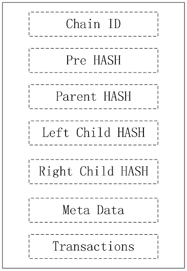

# 区块结构

相比其他区块链的区块，新的区块结构增加了Chain ID，Parent Hash，Child Hash。  
成员说明：

* Chain ID：标记区块属于哪一条链，第一条链的ID为1。左子链ID为当前ID\*2，右子链ID为当前ID*2+1。
* PreHash：本链前一个区块的哈希值。
* Parent Hash：父链区块的哈希值，没有时为空值。
* Left Child Hash：左子链的区块哈希值，没有时为空值。
* Right Child Hash：右子链的区块哈希值，没有时为空值。
* Meta Data：其他的区块信息，包括时间戳、签名、矿工地址等
* Transactions：交易列表

区块的大小限制默认为1M(该值可以根据需要，动态调整)。该值只是区块中交易的总大小，不包含区块头信息。  
每条链的第一个区块都相同，称其为创世区块。  
创世区块的Chain ID为0。  
