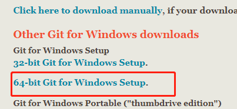
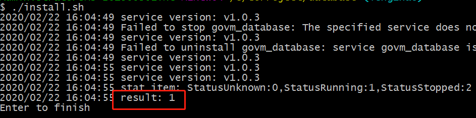
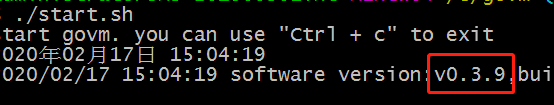
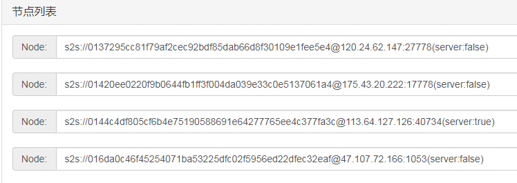
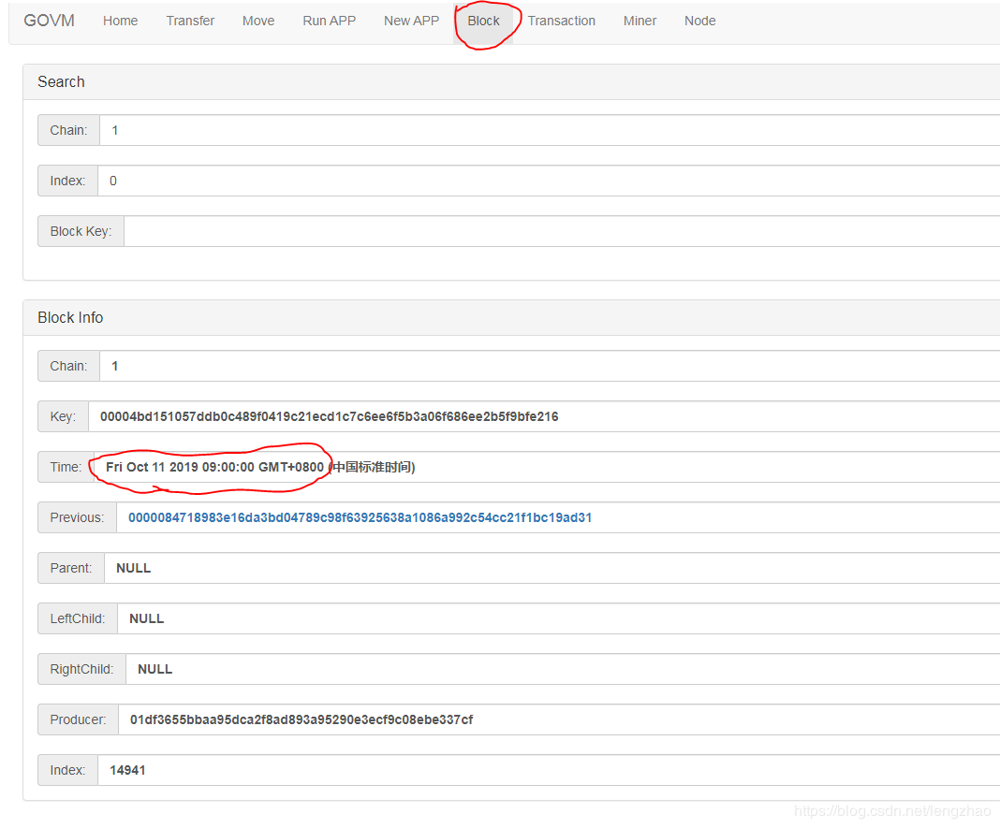
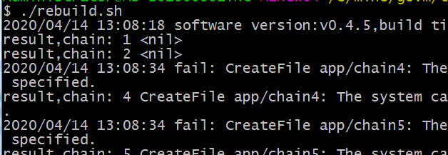

# Mining (Windows)

- [Mining (Windows)](#mining-windows)
  - [Hardware-Anforderungen](#hardware-anforderungen)
  - [Konfiguration der Programmierumgebung](#konfiguration-der-programmierumgebung)
    - [Golang-Installation](#golang-installation)
    - [Git-Installation](#git-installation)
  - [Den Source-Code herunterladen](#den-source-code-herunterladen)
  - [Nutze die Backup-Dateien](#nutze-die-backup-dateien)
  - [Starten](#starten)
  - [Wallet-Datei speichern](#wallet-datei-speichern)
  - [Check](#check)
    - [pr�fe ob andere Nodes verbunden sind](#prfe-ob-andere-nodes-verbunden-sind)
    - [Best�tige Start der Synchronisierung der Bl�cke](#besttige-start-der-synchronisierung-der-blcke)
    - [Software-Update](#software-update)
      - [Datenbank-Update](#datenbank-update)
      - [Govm-Update](#govm-update)
  - [Smart-Contract aufbauen](#smart-contract-aufbauen)
  - [Mining](#mining)
  - [Mehr Informationen](#mehr-informationen)

## Hardware-Anforderungen

1. Wir nutzen Windows als Beispiel. Bei anderen Betriebssystemen ist es allerdings die gleiche Prozedur.
2. 64-bit-Windows-System und mindestens Windows 7 wird ben�tigt.
    Anzeige: Computer / Mein Computer-> Rechtsklick-> Eigenschaften-> System: 64-bit-Betriebssystem.
    Ein 32-bit-System wird nicht unterst�tzt.
3. Gro�e Festplatte
  Die Blockchain speichert hohe Datenmengen und ben�tigt mindestens 50gb Speicherplatz. Im Falle von weniger Transaktionen wird weniger Platz ben�tigt. Es ist m�glich 1gb und mehr an Datenmengen t�glich herunterladen zu m�ssen. SSDs sind gut geeignet.
4. Netzwerk
  Die Software muss jederzeit verbunden sein. Schlechte Verbindungen beeinflussen das Mining, weil st�ndig Daten mit anderen Nodes synchronisiert werden.
5. Die neue und alte Version sind nicht kompatibel. Falls die alte Version bereits installiert war, m�ssen die Datenbank und govm gel�scht werden.
   1. Speichere govm/conf/wallet.key an einem sicheren Ort.
   2. Beende das Govm-Programm, f�hre uninstall im Ordner "database" aus und schlie�e alle Fenster.
   3. L�sche die "database"-  und "govm"-Ordner.

## Konfiguration der Programmierumgebung

### Golang-Installation

1. Download-Adresse: <https://golang.org/dl/>
2. Downloade  go1.13.\*.windows-amd64.msi
3. Normale Installation durchf�hren und alle Standard-Einstellungen beibehalten. Es sind keine �nderungen n�tig.

### Git-Installation

1. Download-Adresse: <https://git-scm.com/downloads>
2. Auf "windows" zum Herunterladen klicken

    

3. Nach dem herunterladen einfach installieren und Standardeinstellungen beibehalten.
4. Windows 10 und Windows Server 2012 empfehlen den Computer neuzustarten.

## Den Source-Code herunterladen

1. W�hle eine Festplatte aus (freier Speicherplatz ben�tigt).
2. Erstelle einen Ordner (keine chinesische Sprache verwenden)
3. Ordner ausw�hlen, Rechtsklick auf Leerstelle und "Git Bash Here" ausw�hlen.
4. Best�tigen und Enter dr�cken: git clone <https://github.com/lengzhao/database.git>
5. Best�tigen und Enter dr�cken: git clone <https://github.com/govm-net/govm.git>
6. Der Computer beginnt den Code herunterzuladen.
7. Falls erfolgreich, sollten 2 Ordner existieren: database und govm.
8. Kompiliere den Code nachdem er heruntergeladen wurde.
9. Erst database kompilieren: run upgrade.sh
10. Kompiliere govm: run upgrade.sh
11. govm.exe wird erstellt.

## Nutze die Backup-Dateien

1. Dieser Schritt muss nicht durchgef�hrt werden. Falls dieser Schritt nicht ausgef�hrt wird, werden Daten von Beginn an synchronisiert, was einige Tage dauern kann.
2. Falls bereits begonnen:
   * Schlie�e "govm" and "database".
   * database/uninstall.sh ausf�hren.
   * database/db_dir l�schen.
3. �ffne <http://govm.net/dl/> in deinem Browser.
4. Downloade: database_data_v\*.tar.gz und govm_app_v\*.gz
5. Nach dem herunterladen, verschiebe database_data_v\*.tar.gz -Datei in den "database"-Ordner und dekomprimiere es in die aktuelle Datei ("database"-Ordner).
6. Nach erfolgreicher Dekomprimierung findest du einen "db_dir"-Ordner im "database" -Ordner.
7. Verschiebe govm_app_v\*.gz -Datei in den "govm"-Ordner und dekomprimiere es in die aktuelle Datei("govm"-Ordner).
8. Nach erfolgreicher Dekomprimierung findest du einen "App"-Ordner im "govm"-Ordner.
9. Gehe zu govm-> tools-> rebuild, Doppelklick und rebuild.sh ausf�hren. Der Smart-Contract wird neu kompiliert.

## Starten

1. **Falls du eine Anti-Virus-Software nutzt, stelle ein, dass govm ausgef�hrt werden darf. Falls nicht, wird das Programm von der Software entfernt werden.**
2. Registriere die Datenbank als Systemservice, gib den "database"-Ordner an und f�hre "install.sh" aus. Die Anti-Virus-Software mag eine Risikomeldung geben. Du musst die Ausf�hrung erlauben.

    

3. Falls es nicht erfolgreich gewesen ist, kannst du die Datenbank via "database.exe" starten.
4. Starte govm via "govm.exe". Das Programm wird gestartet und zeigt die Softwareversion an.

   

5. Logge dich im Browser ein: <http://localhost:9090>
6. Nachdem das Programm startet wird es automatisch mit anderen Nodes verbinden und die Daten synchronisieren. Synchronisationszeit ist abh�ngig vom Netzwerk und von der Festplatte.
7. Nachdem die Synchronisation vollst�ndig ist startet das Mining automatisch.
8. Blockzeit ist eine Minute. Wer den Block findet wird daf�r belohnt. D.h. je st�rker deine Rechenkraft, desto gr��er ist deine Belohnung.

## Wallet-Datei speichern

Die **wallet.key** im "conf"-Ordner ist deine Wallet-Datei. Bitte erstelle ein Backup und sichere sie an einem geeigneten ort. Falls du die Datei verlierst, gibt es keine M�glichkeit sie wiederherzustellen und deine W�hrung wird f�r immer verloren sein.

## Check

### pr�fe ob andere Nodes verbunden sind

1. <http://localhost:9090> im Browser �ffnen.
2. Dr�cke auf "Node" in der Ecke oben rechts
3. Best�tige, dass dort mehrere Nodes angezigt werden (siehe unten)

      

4. Wenn du keine Nodes siehst, �berpr�fe ob das Netzwerk funktioniert. Falls ja, dr�cke "submit directly" und verbinde dich neu.
5. Aktualisiere die Seite und best�tige, dass du Nodes findest.

### Best�tige Start der Synchronisierung der Bl�cke

1. <http://localhost:9090> im Browser eingeben.
2. Dr�cke auf "Block".
3. Die Blockzeit hat sich ver�ndert. Nachdem das Update vollst�ndig durchgef�hrt ist, wird die Blockzeit der Systemzeit gleichen. Siehe unten.

    

### Software-Update

#### Datenbank-Update

1. Schlie�e govm.exe
2. Navigiere in den "database"-Ordner.
3. Schlie�e das "database"-Fenster (falls es nicht offen ist, ignoriere diesen Schritt).
4. upgrade.sh ausf�hren.
5. Starte "database": install.sh oder database.exe ausf�hren.

#### Govm-Update

1. Schlie�e das Programm. Stelle im Task-Manager sicher, dass govm.exe nicht ausgef�hrt wird. Falls doch, beende den Prozess.
2. upgrade.sh ausf�hren.
3. govm.exe ausf�hren um das Programm zu starten.
4. Falls eine Ausnahme erfolgt, wird sich das Programm automatisch schlie�en. Ansonsten wird es weiterlaufen.

## Smart-Contract aufbauen

1. In govm/tools/rebuild/, Bash �ffnen.
2. In Bash, "./rebuild.sh" ausf�hren.
3. Schlie�e aufbauen des Smart-Contracts ab.
4. Es zeigt "result,chain: 1 <nil>" bei erfolgreichem Abschluss  

  

## Mining

1. Schau dir das Mining-Tutorial an [Mining-Tutorial](mining.md)
2. �nde die Adresse der Server zu der Adresse deines eigenen Nodes.

## Mehr Informationen

Kontaktinformationen:  

[discord](https://discord.gg/u3wYFkD)

