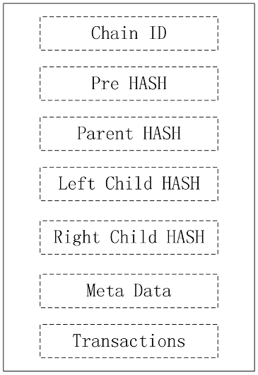

# Block-Struktur

Im Vergleich mit anderen Blockchains, f�gt die neue Block-Struktur Chain ID, Eltern-Hash und Child-Hash hinzu.

Mitglieder-Beschreibung:  

* Ketten-ID: Markieren Sie, zu welcher Kette der Block geh�rt. Die ID der ersten Kette ist 1. Die linke ID der untergeordneten Kette ist die aktuelle ID \* 2, und die rechte ID der untergeordneten Kette ist die aktuelle ID \* 2 + 1.
* PreHash: Hashwert des vorherigen Blocks der Kette.
* Eltern-Hash: Hashwert des Eltern-Block. Falls nicht vorhanden, ist es 0.
* Hash linkes Kind: Block-Hash-Wert der linken Kind-Kette. Falls nicht vorhanden, ist es 0.
* Hash rechtes Kind: Block-Hash-Wert der rechten Kind-Kette. Falls nicht vorhanden, ist es 0.
* Metadaten: andere Blockinformationen, einschlie�lich Zeitstempel, Signatur, Miner-Adresse usw.
* Transaktionen: Transaktions-Liste

Das Limit der Blockgr��e ist standardgem�� 1M (dieser Wert kann ver�ndert werden falls n�tig).

Der erste Block jeder Kette ist der selbe.

Die Ketten-ID des ersten Blocks ist 0.
