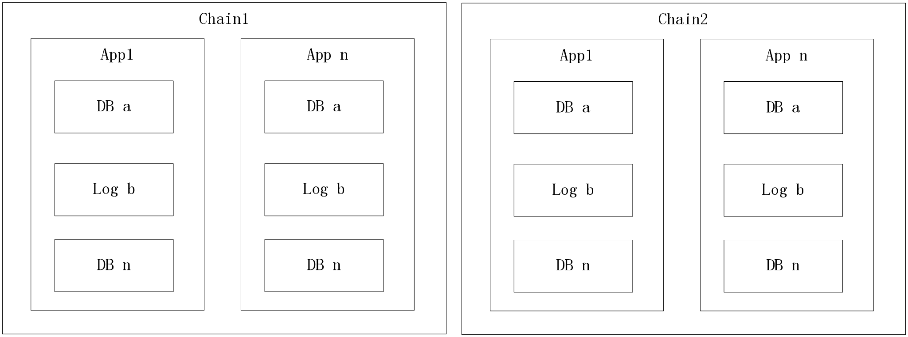

# Logische Speicherstruktur

Jede Kette hat unabh�ngige Datenspeicher-Dateien.

Jeder Smart-Contract hat unabh�ngigen Daten-Speicherplatz.

Jeder Smart-Contract kann verschiedene Datantabellen erstellen.

