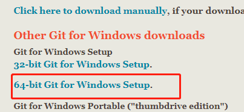
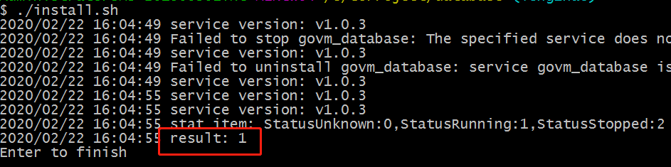
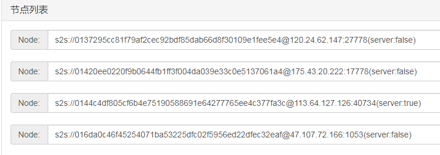
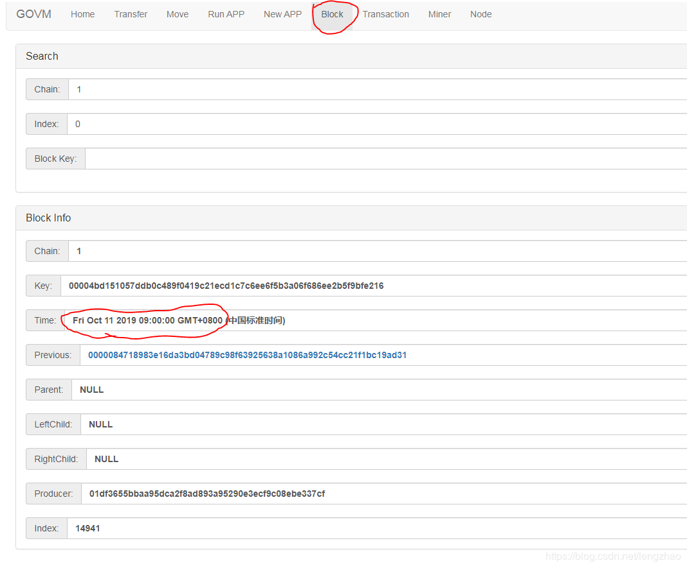
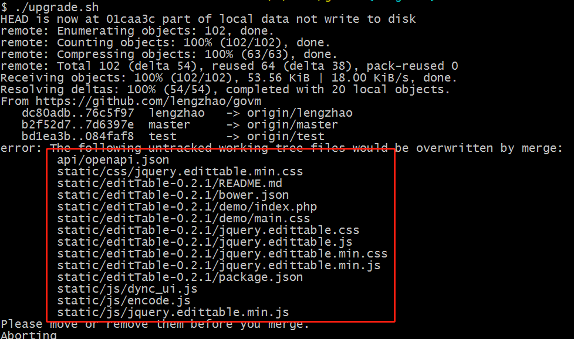

# Mine(windows)

- [Mine(windows)](#minewindows)
  - [Hardware requirements](#hardware-requirements)
  - [Environment setup](#environment-setup)
    - [golang installation](#golang-installation)
    - [Git installation](#git-installation)
  - [Download the source code](#download-the-source-code)
  - [Starting](#starting)
  - [Save wallet file](#save-wallet-file)
  - [Check](#check)
    - [Check if other nodes are connected](#check-if-other-nodes-are-connected)
    - [Confirm start syncing blocks](#confirm-start-syncing-blocks)
    - [View your token](#view-your-token)
    - [How to transfer](#how-to-transfer)
    - [Token Unit](#token-unit)
    - [Update software](#update-software)
    - [No mine, Why](#no-mine-why)
  - [More information](#more-information)

## Hardware requirements

1. Now take windows as an example. Other systems are the same process.  
2. 64-bit windows system, at least windows7  
    View: Computer / My Computer-> Right-click-> Properties-> System type: 64-bit operating system  
    If it is 32-bit, it is not supported.  
3. Larger disk space  
   blockchain needs to store a large amount of data, so it needs a lot of space, at least 50G  
    upfront, because there are fewer transactions, and less space is required. There may be 1G of new data in the next day.  
    If there is a solid state drive ,will be better  
4. Network  
    Software always needs to be networked, and because it needs to synchronize data with other nodes, if the network is too poor, it will affect mining

## Environment setup

### golang installation

1. Download address:https://golang.org/dl/  
2. Download go1.13.\*.windows-amd64.msi
3. Direct installation, all default configuration, no need to modify

### Git installation

1. Download address: https://git-scm.com/downloads
2. Click on windows to download  
    
3. After downloading, install directly, all default configuration
4. Win10 and win2012 suggest to restart the computer

## Download the source code

1. Select a disk (requires more free space)
2. Create a folder (do not use Chinese, the path is not too long)
3. Enter the folder, right-click in the blank space, and select "Git Bash Here"
4. Enter and press enter: git clone https://github.com/lengzhao/database.git
5. Enter and press enter: git clone https://github.com/lengzhao/govm.git
6. Will start downloading the code
7. After success, there should be 2 folders, database and govm
8. After the code is downloaded, compile the code
9. First compile the database

    ```bash
    cd database/
    go build
    ll database.exe
    ```

10. Compile govm:

    **If you have anti-virus software, please set the folder as trusted, otherwise the app will be cleaned by the anti-virus software.**
    run upgrade.sh or do as follows in bash

    ```bash
    cd ../govm/
    go build
    ll govm.exe
    ```

11. the govm.exe is generated

## Starting

1. Register the database as a system service, enter the database folder, double-click install.sh, the anti-virus software may have a risk prompt, you need to allow this operation  
    
2. If it is not successful, you can start the database by double-clicking database.exe
3. Start govm, click start.sh, the program will start and show the software version  
    
4. You can use a browser to log in to http://localhost:9090
5. After the program starts, it will automatically connect to other nodes and start to synchronize data (the synchronization time is related to the network and disk)
6. After synchronization is completed, mining will start automatically
7. One block per minute, whoever digs, the reward is who it is, so competition is needed. The stronger the computer's computing power, the easier it is to dig

## Save wallet file

The **wallet.key** in the conf folder is the wallet file. Please backup it to save it.  
If it is lost, it will be lost forever and the virtual currency will never be found again.

## Check

### Check if other nodes are connected

1. Browser opens http://localhost:9090
2. Click on "Node" in the upper right corner
3. Confirm that there are multiple nodes in Nodes, as shown below  
      
4. If there are no nodes, first check whether the network is normal. If the network is normal, click Submit directly and reconnect.
5. Refresh the page and confirm that there are nodes in Nodes

### Confirm start syncing blocks

1. Browser opens http://localhost:9090
2. Click "Block"
3. The block time has changed. After the update is completed, the block time will be the same as system time, as shown below.  
    

### View your token

1. Browser opens http://localhost:9090
2. If already open, click Home
3. The following message will be displayed  
    
4. "Wallet Address" is your wallet address, this address is used for transfer in and out
5. Balance is the balance on the wallet, and the reward for each mining is about 5000t9.

### How to transfer

1. Browser opens http://localhost:9090
2. Click Transfer
3. Fill in the peer's wallet address in "Peer"
4. "Amount" fill in the transfer amount
5. Click Submit
6. The transfer is not real-time. This transaction needs to be packaged into a block before it officially takes effect.

### Token Unit

1. Units t0,t3,t6,t9
2. The default unit is t9, which is 10 ^ 9 \* t0
3. t3 = 1000 \* t0, t6 = 1000 \* t3, t9 = 1000 \* t6
4. The reward of each mining is about 5000t9
5. The default unit can be changed on the "Setting" page

### Update software

1. Exit the program, make sure there is no govm.exe process in the task manager, and if so, force the process to end
2. You can directly double-click upgrade.sh to upgrade, or perform the following operations to upgrade
   * In the govm folder, right-click in the blank space and select "Git Bash Here"  
   * Enter: git pull  
   * If the update fails (error), delete the conflicting files according to the prompt, and perform the previous step again. As shown in the figure below, you need to delete the files listed in the red box, and then execute upgrade.sh  
   * After the update is complete, recompile

      

3. Click start.sh to start the program
4. If an exception occurs, the program will exit directly, otherwise it will continue to run(such as: not run database)

### No mine, Why

1. The data has not been synchronized. First make sure that the time in the block page is the same as the computer time.
2. If the time in the block page has not changed, check whether there is a node in Node. If not, you need to add it manually
3. Computer time is wrong, make sure the computer time is the same as universal time
4. Computer performance problems, in the early stage, it is easy to dig with ordinary computers. With the increase of nodes, the computing power requirements are getting higher and higher, and ordinary computers are difficult to dig.

## More information

contact details:  

