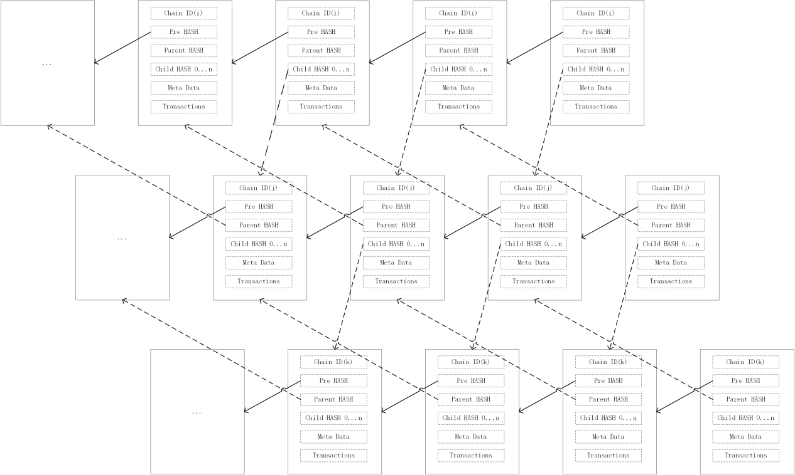

# Block relationship between chains

Suppose the current chain is Chain2, and its parent chain is Chain1. The current block of Chain2 is B2.i(B2 mean the block on Chain2, i mean the id of block), and its ParentHash is B1.j, which requires the timestamp of B2.i minus the timestamp of B1.j More than 8 minutes and less than 10 minutes.  
The time difference is greater than 8 minutes (block confirmation time), which can ensure that the block rollback does not affect the parent chain and the child chain.  
The time difference is less than 10 minutes in order to be able to access data across multiple chains. Across a chain, the maximum time difference is 10 minutes; across n chains, the maximum time difference is n \* 10 minutes. As long as the difference between the block time and the data time (data has time information, see the subsequent data chapter for details) is more than n \* 10 minutes, it is valid data and can be accessed across chains.  

The figure above is a simplified block relationship between the three chains. It is just a simple illustration. The actual parent-child block is farther apart, and the time difference is 8-10 minutes.  
The blockchain realizes the data's non tamperability through the hash locking of the front and back blocks. This project extends it to block hash locking of parent-child chains. In this way, the parent-child chain block is non tamperability.  
The block hash lock between the parent and child chains can ensure the consistency of the information read across the chain.  
At the same time, the time difference between the parent and child blocks is limited, so that cross-chain access can be achieved, as long as the validity of the data is determined by (inter-chain distance * maximum time).  
